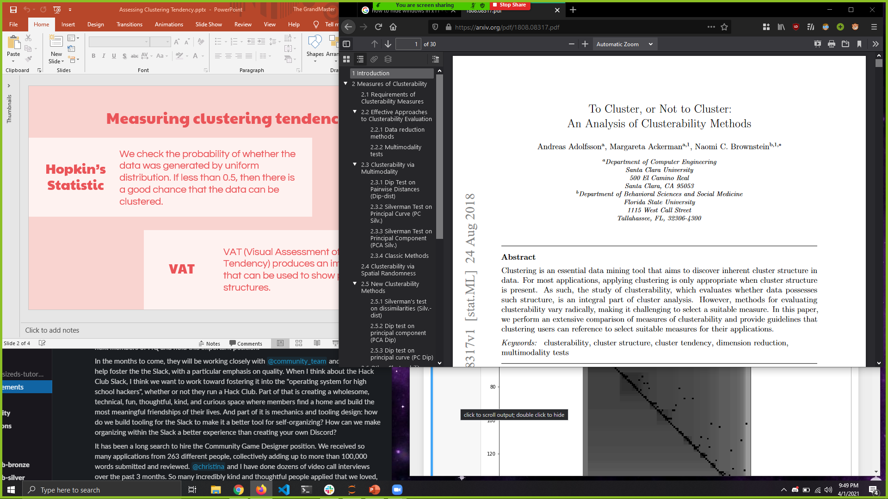
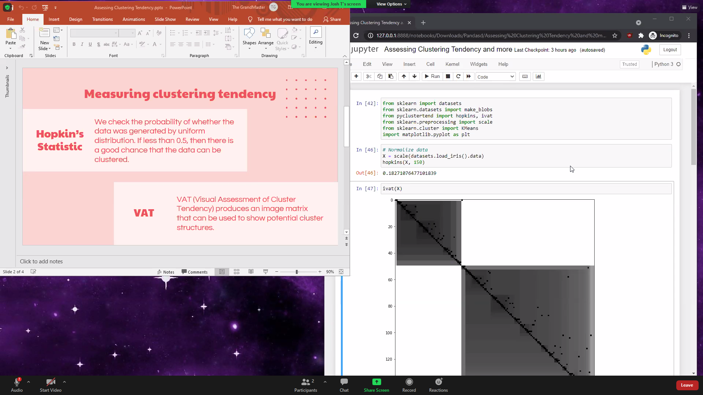
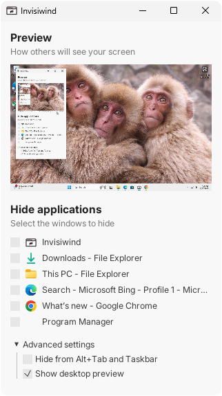

# Invisiwind Enhanced

Invisiwind Enhanced is a fork of [Invisiwind](https://github.com/radiantly/Invisiwind) — a tool that hides specific windows from screen capture while keeping them fully visible and usable on your own screen. This fork adds a system tray, global hotkeys, self-protection from capture, and taskbar hiding for all hidden windows.

## What does it do?

When you share your screen in Zoom, Teams, Google Meet, or any other tool, hidden windows show as black to everyone else. On your side they look and work completely normally.

| Your screen | What others see |
|---|---|
|  |  |

The left screenshot is what you see. The right is what the screenshare shows. Firefox and Slack are hidden from the capture but fully usable.

> This works with any screen sharing app — Zoom, Teams, Discord, OBS, Meet, etc.

### How it works (technical)

The tool uses DLL injection to call [`SetWindowDisplayAffinity`](https://docs.microsoft.com/en-us/windows/win32/api/winuser/nf-winuser-setwindowdisplayaffinity) with `WDA_EXCLUDEFROMCAPTURE` from within the target process. This is the only way Windows allows that API to be called on another process's window.

---

## What's new in this fork

### System tray
Invisiwind lives in the system tray. The taskbar button is gone — click the tray icon to open the panel, right-click for the menu. This means you can never lose access to Invisiwind even if you hide it from screen capture.



### Global hotkeys — browser-safe
Built-in hotkeys that work even when your browser has focus. These deliberately avoid all Chrome/Edge shortcuts:

| Hotkey | Action |
|---|---|
| `Ctrl+Alt+H` | Hide the currently focused window |
| `Ctrl+Alt+U` | Restore the last hidden window |
| Tray icon click | Show / hide the Invisiwind panel |

### Invisiwind panel hidden from screen capture by default
The Invisiwind control panel itself is excluded from screen capture on startup. Your interviewer or meeting attendees cannot see your hide/unhide activity. You can toggle this in Advanced Settings.

### Hidden windows removed from taskbar and Alt+Tab
Every window you hide is also removed from the taskbar and Alt+Tab list. It won't appear as a thumbnail when someone watches you switch windows. The window is still on your screen and fully usable — just invisible to everything that could leak it.

### Self-protection
Invisiwind can never accidentally remove itself from the taskbar or Alt+Tab. The tray icon is always accessible regardless of what settings are enabled.

### Interview workflow
1. Open your notes/reference material in a separate browser window (`Ctrl+N`, not `Ctrl+T`)
2. Hide that window using the checkbox or `Ctrl+Alt+H`
3. Share your main screen — the notes window is invisible to everyone
4. Switch to it freely during the interview — it won't appear in Alt+Tab thumbnails
5. `Ctrl+Alt+U` restores it when you're done

---

## Installation

> [!NOTE]
> This software may be detected as a virus or trojan by your antivirus. This is a false positive caused by the DLL injection technique. The source code is fully open for inspection.

### Installer (recommended)

Download and run `InvisiwindEnhancedInstaller.exe` from the [latest release](../../releases/latest).

The installer adds a Start Menu entry and an optional "start on Windows boot" checkbox.

### Portable zip

Download `InvisiwindEnhanced.zip` from the [latest release](../../releases/latest), extract anywhere, and run `Invisiwind.exe`.

---

## System requirements

- Windows 10 version 2004 (build 19041) or later
- `WDA_EXCLUDEFROMCAPTURE` was introduced in that build — earlier versions show a black rectangle instead of hiding the window

---

## Building from source

See [BUILD.md](BUILD.md) for full instructions. Short version:

```bat
build.bat
```

Requires Rust (MSVC toolchain) and Visual Studio Build Tools. InnoSetup is optional (needed only for the `.exe` installer).

Alternatively, push to GitHub and the Actions workflow builds and publishes everything automatically.

---

## FAQ

**What screen sharing apps does this work with?**
Any app that uses the Windows screen capture API — Zoom, Teams, Google Meet, Discord, OBS, and others.

**Does hiding a window affect its performance?**
No. `WDA_EXCLUDEFROMCAPTURE` only affects the capture pipeline. The window renders normally on your GPU and responds to input as usual.

**Will future instances of an app be automatically hidden?**
No. Each window must be hidden individually. The hotkey (`Ctrl+Alt+H`) makes this fast.

**Can I hide windows using a hotkey without opening the app?**
Yes — `Ctrl+Alt+H` hides the focused window globally. The tray icon in the corner shows how many windows are currently hidden.

**Why does my antivirus flag this?**
DLL injection triggers heuristic scanners regardless of intent. This is a known issue with the original Invisiwind as well. Add a folder exclusion in Windows Security, or submit a false positive report to your antivirus vendor.

**What's the difference between portable and installer?**
Both contain the same files. The installer adds a Start Menu entry, an optional desktop shortcut, and an optional startup entry. The portable zip requires no installation.

---

## Credits

Original Invisiwind by [radiantly](https://github.com/radiantly/Invisiwind). This fork adds tray support, global hotkeys, capture self-exclusion, and taskbar hiding.

## License

MIT
